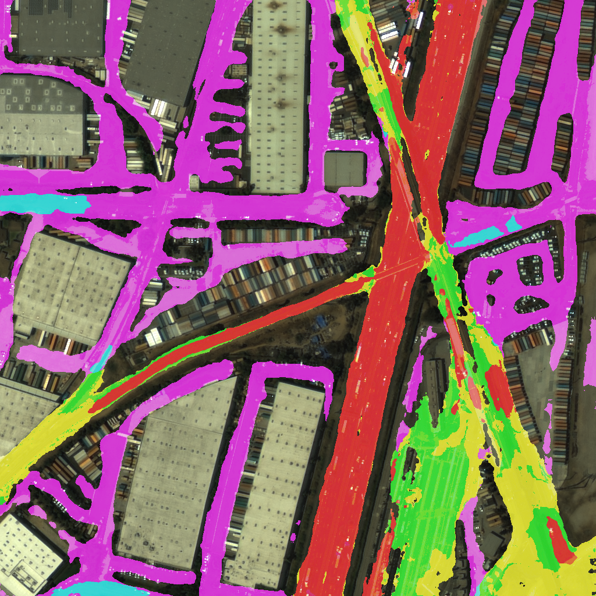
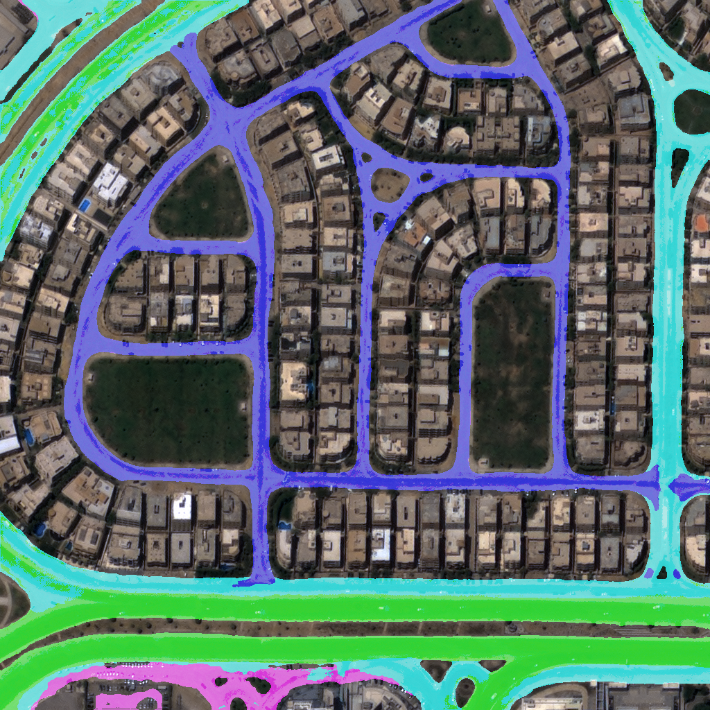
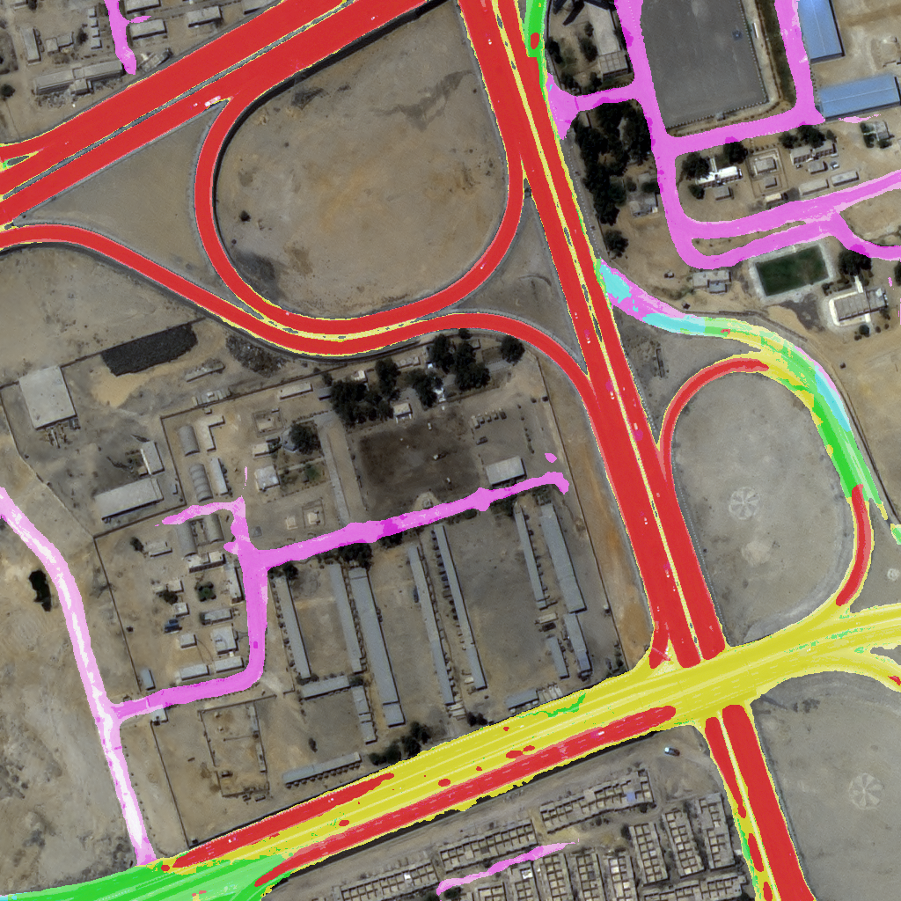
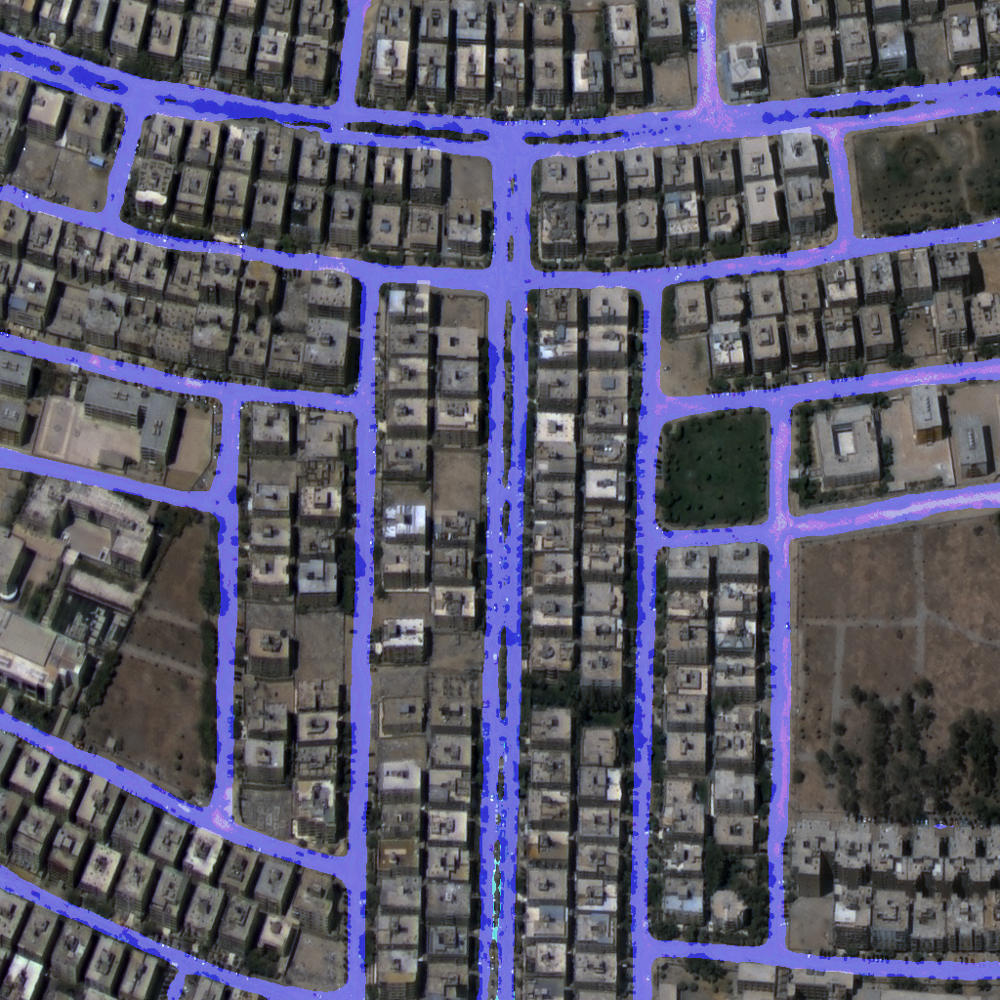
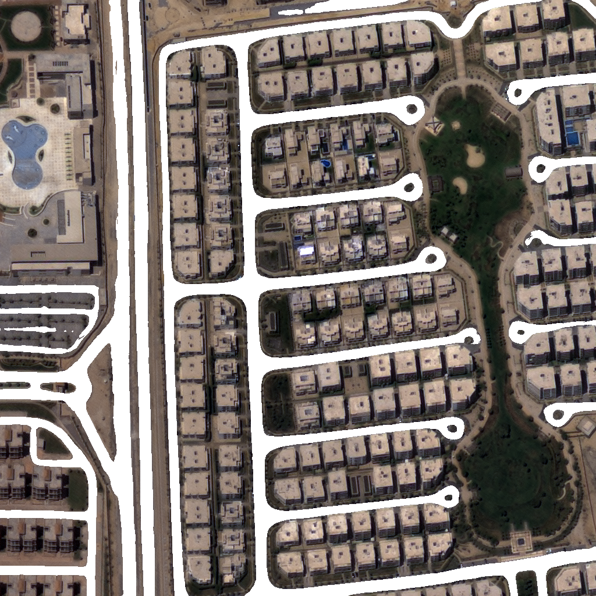
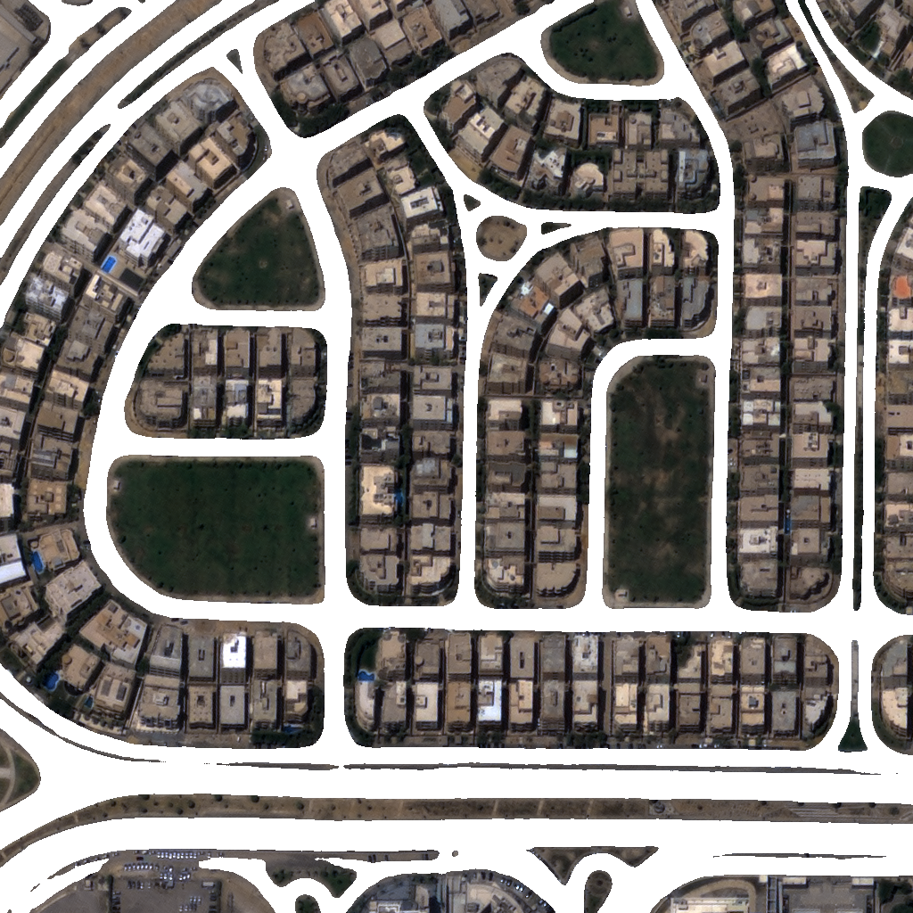
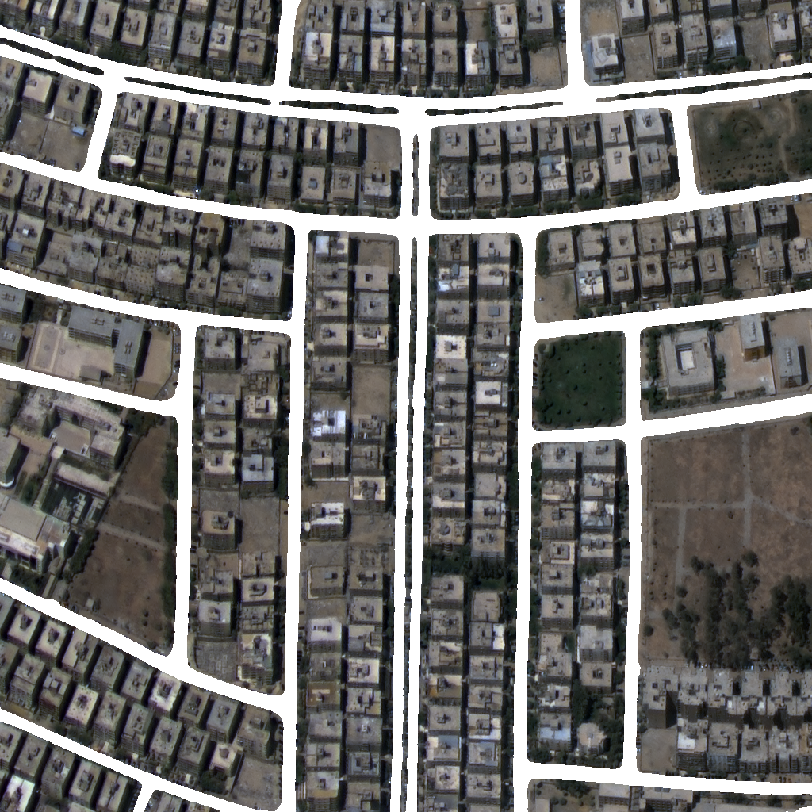
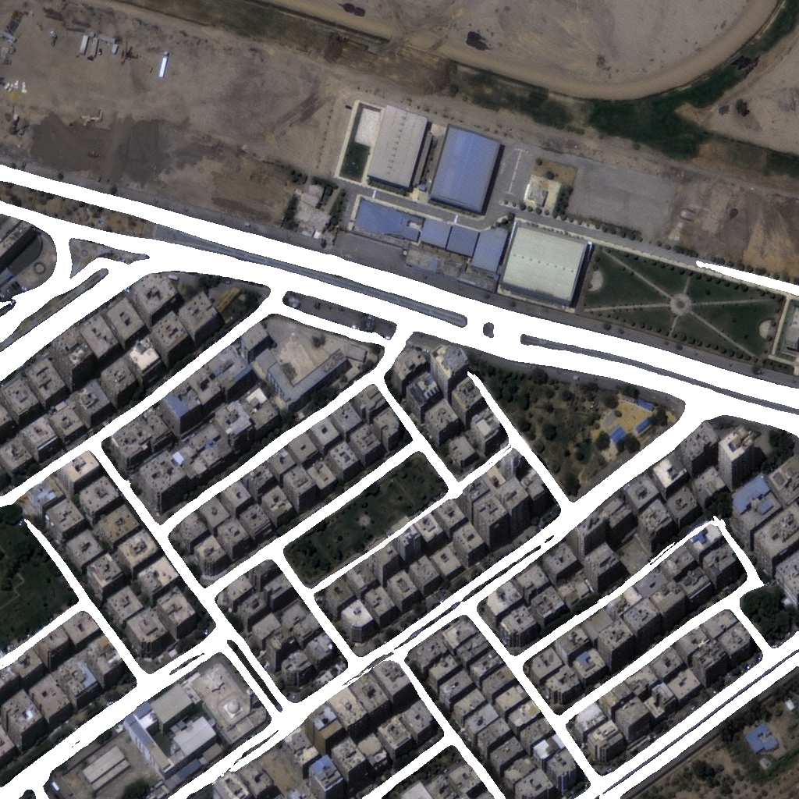

# NL-LinkNet for Multi-class Road Extraction 
Pytorch implementation of **N**on-**L**ocal LinkNet (**NL-LinkNet**) for Multi-class Road Extraction

## 필수 설치 사항
- Cuda >= 8.0
- Python >= 3.5 
- Torchvision >= 0.2.1 
- Torch >= 1.0.0 
- cv2 >= 3.4.0 
- numpy, matplotlib, scikit-image, scipy, pickle, argparse

## 요구 패키지 설치
Install prerequisites with: 
    `pip3 install -r requirements.txt`

## 데이터

### 데이터셋 구조
    ├── road
    │   ├── asset
    │   │   ├── *.png 
    │   │   └── ...
    │   ├── label
    │   │   ├── *.json
    │   │   └── ...
    ├──────── ...

### 학습 데이터 - 평가 데이터 분리
```
cd dataset
python3 split_train_val_nia.py --dataset DATASET_PATH --val_frac 0.1`
cd ..
```

## 학습, 추론, 그리고 평가
### 7개의 클래스를 예측하는 모델
- 학습: `CUDA_VISIBLE_DEVICES=0,1,2,3 python3 train_nia.py --model NL34_LinkNet --name nia_cls_7 --crop_size 768 768 --batch_per_gpu 20 --num_cls 7 --total_epoch 500 --dataset dataset/train`
- 추론: `CUDA_VISIBLE_DEVICES=0 python3 test_nia.py --n_class 7 --name nia_cls_7_500 --model NL34_LinkNet --source dataset/valid`
- 평가: `python3 eval.py --n_class 7 --name nia_cls_7_500`

### 2개의 클래스를 예측하는 모델
- 학습: `CUDA_VISIBLE_DEVICES=0,1,2,3 python3 train_nia.py --model NL34_LinkNet --name nia_cls_2 --crop_size 768 768 --batch_per_gpu 20 --num_cls 2 --total_epoch 500 --dataset dataset/train`
- 추론: `CUDA_VISIBLE_DEVICES=0 python3 test_nia.py --n_class 2 --name nia_cls_2_500 --model NL34_LinkNet --source dataset/valid`
- 평가: `python3 eval.py --n_class 2 --name nia_cls_2_500`

## 결과
### 7개 클래스 모델
|   클래스   |     IOU    |
|:----------:|:----------:|
|    배경    |  0.9094676 |
| 고속화도로 |  0.5073028 |
|   제1도로  | 0.27740318 |
|   제2도로  | 0.15792048 |
|   제3도로  |  0.1662238 |
|  주거도로  |  0.4315384 |
| 미분류도로 |  0.2442351 |

- Pre-training Weight: [Google Drive](https://drive.google.com/file/d/1p4rpS4cDtmGi1Zmk2O0fQDmOn9IihLxj/view?usp=sharing)
- 7개 클래스 평균 mIOU: 0.385
- background 제외 6개 클래스 평균 mIOU: 0.297

#### 추론 결과 예시
<p align="center"> 
     
</p> 
<p align="center"> 
     
</p> 
<p align="center"> 
     
</p> 
<p align="center"> 
     
</p> 


### 2개 클래스 모델
|   클래스   |     IOU    |
|:----------:|:----------:|
|    배경    |  0.9465452 |
|    도로    |  0.6180341 |

- Pre-trainign Weight: [Google Drive](https://drive.google.com/file/d/1QAMsELWaaM8ixWBU7H4HQSNuo3gSZnvf/view?usp=sharing)
- 2개 클래스 평균 mIOU: 0.782

#### 추론 결과 예시
<p align="center"> 
     
</p> 
<p align="center"> 
     
</p> 
<p align="center"> 
     
</p> 
<p align="center"> 
     
</p> 

## 유투브 웨비나

다음 링크에서 본 소스코드 사용법을 참고할 수 있습니다.

https://www.youtube.com/watch?v=sLSPWgD8w0A

## 참조
```
@article{wang2020nl,
  title={NL-LinkNet: Toward Lighter but More Accurate Road Extraction with Non-Local Operations},
  author={Wang, Yooseung and Seo, Junghoon and Jeon, Taegyun},
  journal={IEEE Geoscience and Remote Sensing Letters},
  year={2020}
}
```
